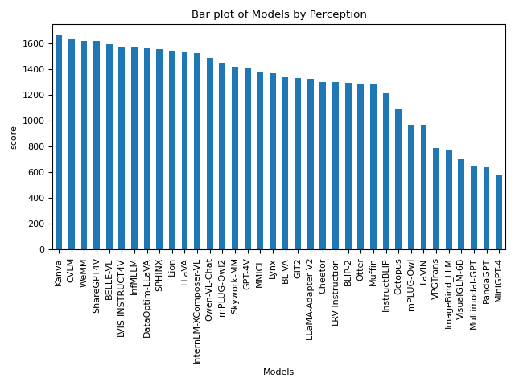
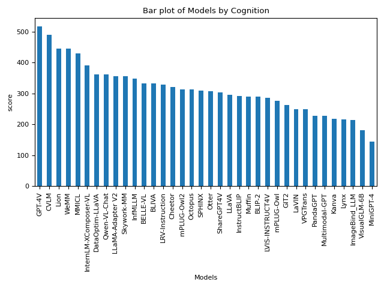
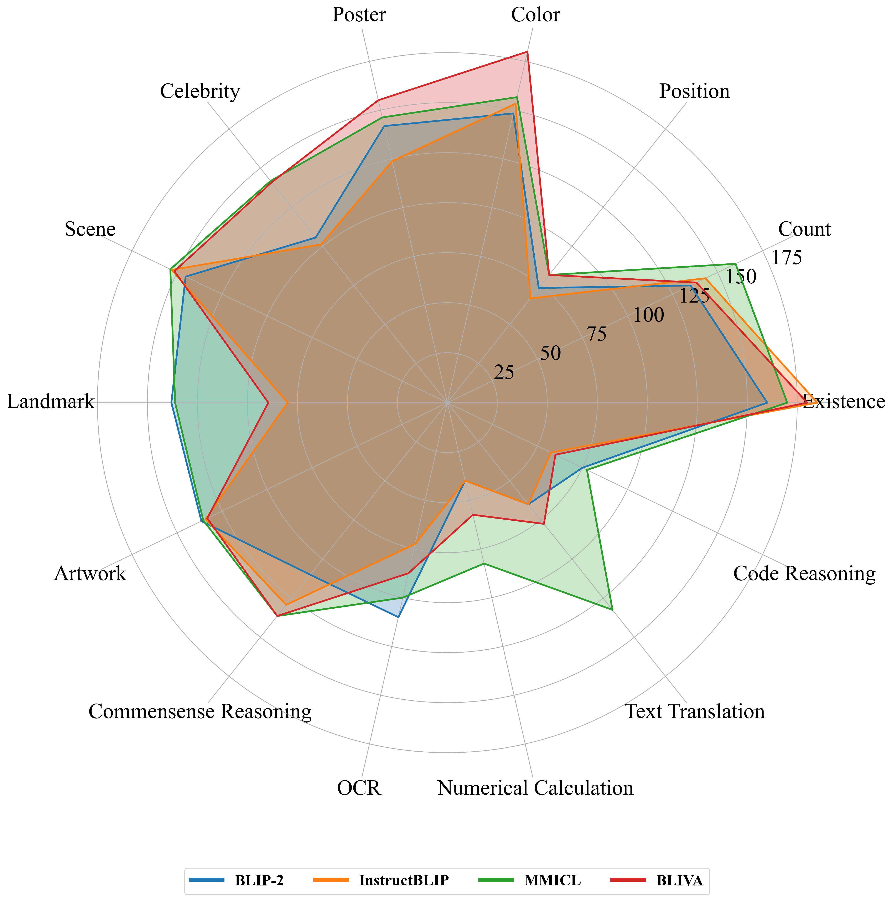
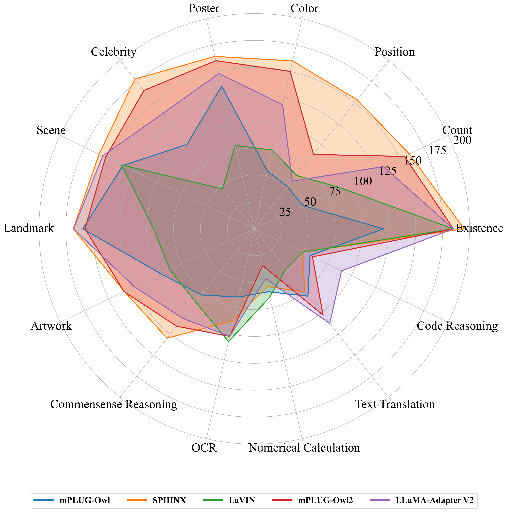
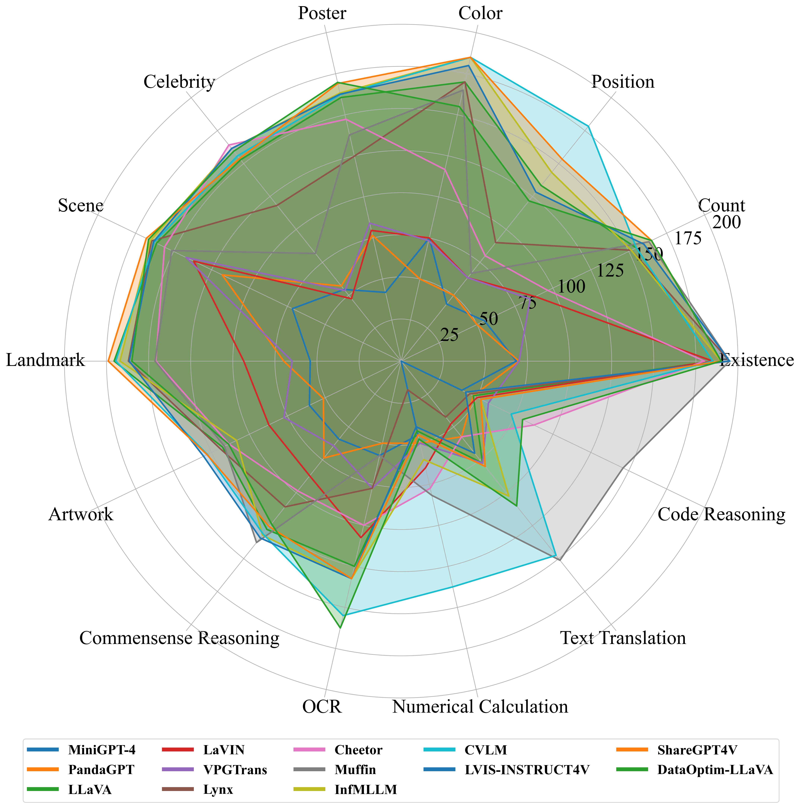

# MLLM-Research-Learn

---

- Conducting learning and research on MLLM based on the [MME](https://github.com/BradyFU/Awesome-Multimodal-Large-Language-Models) rankings.

## MLLM List

**36** advanced MLLMs, including [**BLIP-2**](https://arxiv.org/pdf/2301.12597.pdf), [**InstructBLIP**](https://arxiv.org/pdf/2305.06500.pdf), [**LLaVA**](https://arxiv.org/pdf/2304.08485.pdf), [**MiniGPT-4**](https://arxiv.org/pdf/2304.10592.pdf), [**mPLUG-Owl**](https://arxiv.org/pdf/2304.14178.pdf), [**LLaMA-Adapter V2**](https://arxiv.org/pdf/2304.15010.pdf), [**ImageBind_LLM**](https://github.com/OpenGVLab/LLaMA-Adapter/tree/main), [**Otter**](https://arxiv.org/pdf/2305.03726.pdf), [**VisualGLM-6B**](https://github.com/THUDM/VisualGLM-6B), [**Multimodal-GPT**](https://arxiv.org/pdf/2305.04790.pdf), [**PandaGPT**](https://arxiv.org/pdf/2305.16355.pdf), [**VPGTrans**](https://arxiv.org/pdf/2305.01278.pdf), [**LaVIN**](https://arxiv.org/pdf/2305.15023.pdf), [**Lynx**](https://arxiv.org/pdf/2307.02469.pdf), [**Octopus**](https://github.com/gray311/UnifiedMultimodalInstructionTuning), [**LRV-Instruction**](https://arxiv.org/pdf/2306.14565.pdf), [**Cheetor**](https://arxiv.org/pdf/2308.04152.pdf), [**MMICL**](https://github.com/HaozheZhao/MIC), [**GIT2**](https://arxiv.org/pdf/2205.14100.pdf), [**BLIVA**](https://arxiv.org/pdf/2308.09936.pdf), [**Skywork-MM**](https://github.com/will-singularity/Skywork-MM/tree/main), [**Qwen-VL-Chat**](https://arxiv.org/pdf/2308.12966.pdf), [**InternLM-XComposer-VL**](https://arxiv.org/pdf/2309.15112.pdf), [**Lion**](https://github.com/mynameischaos/Lion), [**Muffin**](https://github.com/thunlp/Muffin), [**WeMM**](https://github.com/scenarios/WeMM), [**SPHINX**](https://github.com/Alpha-VLLM/LLaMA2-Accessory/tree/main/SPHINX), [**InfMLLM**](https://github.com/mightyzau/InfMLLM), [**mPLUG-Owl2**](https://github.com/X-PLUG/mPLUG-Owl/tree/main/mPLUG-Owl2), [**GPT-4V**](https://cdn.openai.com/papers/GPTV_System_Card.pdf), [**CVLM**](https://github.com/buptlihang/CVLM), [**LVIS-INSTRUCT4V**](https://arxiv.org/pdf/2311.07574.pdf), [**Kanva**](https://github.com/llp1992/Kanva), [**DataOptim**](https://github.com/BAAI-DCAI/DataOptim), [**ShareGPT4V**](https://github.com/InternLM/InternLM-XComposer/tree/main/projects/ShareGPT4V)and **[BELLE-VL](https://huggingface.co/BELLE-2/BELLE-VL)** .

---

|                      Models_Perception                       |                       Models_Cognition                       |
| :----------------------------------------------------------: | :----------------------------------------------------------: |
|  |  |

---

## MLLM Arch

- [FlanT5xxl](#FlanT5xxl)

- [LLaMA/LLaMA2](#LLaMA/LLaMA2)

- [Vicuna](#Vicuna)

- [OpenFlamingo](#OpenFlamingo)

- [InternLM](#InternLM)

- [Qwen](#Qwen)

- [GLM](#GLM)

- [MPT](#MPT)

- [Other](#Other)

- ...

---

### FlanT5xxl

| Num. |   Arch.   |                        Model                         |                           Version                            | Perception | Cognition |
| :--: | :-------: | :--------------------------------------------------: | :----------------------------------------------------------: | :--------: | :-------: |
|  1   | FlanT5xxl |    [BLIP-2](https://arxiv.org/pdf/2301.12597.pdf)    | [Flant5xxl](https://github.com/salesforce/LAVIS/tree/main/projects/blip2) |  1293.84   |  290.00   |
|  2   | FlanT5xxl | [InstructBLIP](https://arxiv.org/pdf/2305.06500.pdf) | [FlanT5xxl](https://github.com/salesforce/LAVIS/tree/main/projects/instructblip) |  1212.82   |  291.79   |
|  3   | FlanT5xxl |      [MMICL](https://github.com/HaozheZhao/MIC)      |      [FlanT5xxl](https://arxiv.org/pdf/2309.07915.pdf)       |  1381.73   |  428.93   |
|  4   | FlanT5xxl |    [BLIVA](https://arxiv.org/pdf/2308.09936.pdf)     |       [FlanT5xxl](https://github.com/mlpc-ucsd/BLIVA)        |  1337.73   |  331.43   |

more details 

  

#### Perception
|                        Models                        |                           version                            | existence | count  | position | color  |  OCR   | posters |  cast  | scene  | landmark | artwork |  score  |
| :--------------------------------------------------: | :----------------------------------------------------------: | :-------: | :----: | :------: | :----: | :----: | :-----: | :----: | :----: | :------: | :-----: | :-----: |
|    [BLIP-2](https://arxiv.org/pdf/2301.12597.pdf)    | [Flant5xxl](https://github.com/salesforce/LAVIS/tree/main/projects/blip2) |  160.00   | 135.00 |  73.33   | 148.33 | 110.00 | 141.84  | 105.59 | 145.25 |  138.00  | 136.50  | 1293.84 |
| [InstructBLIP](https://arxiv.org/pdf/2305.06500.pdf) | [FlanT5xxl](https://github.com/salesforce/LAVIS/tree/main/projects/instructblip) |  185.00   | 143.33 |  66.67   | 153.33 | 72.50  | 123.81  | 101.18 | 153.00 |  79.75   | 134.25  | 1212.82 |
|      [MMICL](https://github.com/HaozheZhao/MIC)      |      [FlanT5xxl](https://arxiv.org/pdf/2309.07915.pdf)       |  170.00   | 160.00 |  81.67   | 156.67 | 100.00 | 146.26  | 141.76 | 153.75 |  136.13  | 135.50  | 1381.73 |
|    [BLIVA](https://arxiv.org/pdf/2308.09936.pdf)     |       [FlanT5xxl](https://github.com/mlpc-ucsd/BLIVA)        |  180.00   | 138.33 |  81.67   | 180.00 | 87.50  | 155.10  | 140.88 | 151.50 |  89.50   | 133.25  | 1337.73 |

#### Cognition

|                        Models                        |                           version                            | Common_Sense_Reasoning | Numerical_Calculation | Text_Translation | Code_Reasoning | score  |
| :--------------------------------------------------: | :----------------------------------------------------------: | :--------------------: | :-------------------: | :--------------: | :------------: | :----: |
|    [BLIP-2](https://arxiv.org/pdf/2301.12597.pdf)    | [Flant5xxl](https://github.com/salesforce/LAVIS/tree/main/projects/blip2) |         110.00         |         40.00         |      65.00       |     75.00      | 290.00 |
| [InstructBLIP](https://arxiv.org/pdf/2305.06500.pdf) | [FlanT5xxl](https://github.com/salesforce/LAVIS/tree/main/projects/instructblip) |         129.29         |         40.00         |      65.00       |     57.50      | 291.79 |
|      [MMICL](https://github.com/HaozheZhao/MIC)      |      [FlanT5xxl](https://arxiv.org/pdf/2309.07915.pdf)       |         136.43         |         82.50         |      132.50      |     77.50      | 428.93 |
|    [BLIVA](https://arxiv.org/pdf/2308.09936.pdf)     |       [FlanT5xxl](https://github.com/mlpc-ucsd/BLIVA)        |         136.43         |         57.50         |      77.50       |     60.00      | 331.43 |

---

### LLaMA/LLaMA2

| Num. | Arch. |                            Model                             |                           Version                            | Perception | Cognition |
| :--: | :---: | :----------------------------------------------------------: | :----------------------------------------------------------: | :--------: | :-------: |
|  1   | LLaMA |      [mPLUG-Owl](https://arxiv.org/pdf/2304.14178.pdf)       | [Llama-7B](https://huggingface.co/MAGAer13/mplug-owl-llama-7b) |   967.34   |  276.07   |
|  2   | LLaMA | [SPHINX](https://github.com/Alpha-VLLM/LLaMA2-Accessory/tree/main/SPHINX) | [LLaMA2-13B](https://github.com/Alpha-VLLM/LLaMA2-Accessory/tree/main/SPHINX) |  1560.15   |  310.00   |
|  3   | LLaMA |        [LaVIN](https://arxiv.org/pdf/2305.15023.pdf)         |       [LAVIN-13B](https://github.com/luogen1996/LaVIN)       |   963.60   |  249.64   |
|  4   | LLaMA |      [mPLUG-Owl2](https://arxiv.org/pdf/2311.04257.pdf)      | [LLaMA2-7B](https://github.com/X-PLUG/mPLUG-Owl/tree/main/mPLUG-Owl2) |  1450.20   |  313.21   |
|  5   | LLaMA |   [LLaMA-Adapter V2](https://arxiv.org/pdf/2304.15010.pdf)   | [LLaMA-Adapter-v2.1-7B](https://github.com/OpenGVLab/LLaMA-Adapter/tree/main/llama_adapter_v2_multimodal7b) |  1328.39   |  356.43   |

more details 

  

#### Perception

| Models                                                       | version                                                      | existence | count  | position | color  | OCR    | posters_200 | cast_200 | scene_200 | landmark_200 | artwork_200 | score   |
| ------------------------------------------------------------ | ------------------------------------------------------------ | --------- | ------ | -------- | ------ | ------ | ----------- | -------- | --------- | ------------ | ----------- | ------- |
| [mPLUG-Owl](https://arxiv.org/pdf/2304.14178.pdf)            | [Llama-7B](https://huggingface.co/MAGAer13/mplug-owl-llama-7b) | 120.00    | 50.00  | 50.00    | 55.00  | 65.00  | 136.05      | 100.29   | 135.50    | 159.25       | 96.25       | 967.34  |
| [SPHINX](https://github.com/Alpha-VLLM/LLaMA2-Accessory/tree/main/SPHINX) | [LLaMA2-13B](https://github.com/Alpha-VLLM/LLaMA2-Accessory/tree/main/SPHINX) | 195.00    | 160.00 | 153.33   | 160.00 | 87.50  | 164.29      | 177.94   | 160.00    | 168.09       | 134.00      | 1560.15 |
| [LaVIN](https://arxiv.org/pdf/2305.15023.pdf)                | [LAVIN-13B](https://github.com/luogen1996/LaVIN)             | 185.00    | 88.33  | 63.33    | 75.00  | 107.50 | 79.59       | 47.35    | 136.75    | 93.50        | 87.25       | 963.60  |
| [mPLUG-Owl2](https://arxiv.org/pdf/2311.04257.pdf)           | [LLaMA2-7B](https://github.com/X-PLUG/mPLUG-Owl/tree/main/mPLUG-Owl2) | 185.00    | 155.00 | 88.33    | 150.00 | 102.50 | 160.20      | 164.41   | 153.25    | 157.25       | 134.25      | 1450.20 |
| [LLaMA-Adapter V2](https://arxiv.org/pdf/2304.15010.pdf)     | [LLaMA-Adapter-v2.1-7B](https://github.com/OpenGVLab/LLaMA-Adapter/tree/main/llama_adapter_v2_multimodal7b) | 185.00    | 133.33 | 56.67    | 118.33 | 102.50 | 147.96      | 136.76   | 156.25    | 167.84       | 123.75      | 1328.39 |

#### Cognition

|                            Models                            |                           version                            | Common_Sense_Reasoning | Numerical_Calculation | Text_Translation | Code_Reasoning | score  |
| :----------------------------------------------------------: | :----------------------------------------------------------: | :--------------------: | :-------------------: | :--------------: | :------------: | :----: |
|      [mPLUG-Owl](https://arxiv.org/pdf/2304.14178.pdf)       | [Llama-7B](https://huggingface.co/MAGAer13/mplug-owl-llama-7b) |         78.57          |         60.00         |      80.00       |     57.50      | 276.07 |
| [SPHINX](https://github.com/Alpha-VLLM/LLaMA2-Accessory/tree/main/SPHINX) | [LLaMA2-13B](https://github.com/Alpha-VLLM/LLaMA2-Accessory/tree/main/SPHINX) |         130.00         |         55.00         |      75.00       |     50.00      | 310.00 |
|        [LaVIN](https://arxiv.org/pdf/2305.15023.pdf)         |       [LAVIN-13B](https://github.com/luogen1996/LaVIN)       |         87.14          |         65.00         |      47.50       |     50.00      | 249.64 |
|      [mPLUG-Owl2](https://arxiv.org/pdf/2311.04257.pdf)      | [LLaMA2-7B](https://github.com/X-PLUG/mPLUG-Owl/tree/main/mPLUG-Owl2) |         115.71         |         35.00         |      102.50      |     60.00      | 313.21 |
|   [LLaMA-Adapter V2](https://arxiv.org/pdf/2304.15010.pdf)   | [LLaMA-Adapter-v2.1-7B](https://github.com/OpenGVLab/LLaMA-Adapter/tree/main/llama_adapter_v2_multimodal7b) |         106.43         |         47.50         |      112.50      |     90.00      | 356.43 |

---

### Vicuna

| Num. | Arch.  |                           Model                           |                           Version                            | Perception | Cognition |
| :--: | :----: | :-------------------------------------------------------: | :----------------------------------------------------------: | :--------: | :-------: |
|  1   | Vicuna |     [MiniGPT-4](https://arxiv.org/pdf/2304.10592.pdf)     |    [Vicuna-13B](https://github.com/Vision-CAIR/MiniGPT-4)    |   581.66   |  144.29   |
|  2   | Vicuna |     [PandaGPT](https://arxiv.org/pdf/2305.16355.pdf)      |       [Vicuna-7B](https://github.com/yxuansu/PandaGPT)       |   642.59   |  228.57   |
|  3   | Vicuna |       [LLaVA](https://arxiv.org/pdf/2304.08485.pdf)       |      [Vicuna-13B](https://github.com/haotian-liu/LLaVA)      |  1531.31   |  295.36   |
|  4   | Vicuna |       [LaVIN](https://arxiv.org/pdf/2305.15023.pdf)       |       [LAVIN-13B](https://github.com/luogen1996/LaVIN)       |   963.60   |  249.64   |
|  5   | Vicuna |     [VPGTrans](https://arxiv.org/pdf/2305.01278.pdf)      |      [Vicuna-7B](https://github.com/VPGTrans/VPGTrans)       |   790.45   |  249.29   |
|  6   | Vicuna |       [Lynx](https://arxiv.org/pdf/2307.02469.pdf)        |      [Vicuna-7B](https://github.com/bytedance/lynx-llm)      |  1373.24   |  215.71   |
|  7   | Vicuna |      [Cheetor](https://arxiv.org/pdf/2308.04152.pdf)      |       [Vicuna-7B](https://github.com/DCDmllm/Cheetah)        |  1299.97   |  321.07   |
|  8   | Vicuna |        [Muffin](https://github.com/thunlp/Muffin)         |        [Vicuna-13B](https://github.com/thunlp/Muffin)        |  1281.02   |  290.00   |
|  9   | Vicuna |      [InfMLLM](https://github.com/mightyzau/InfMLLM)      |      [Vicuna-13B](https://github.com/mightyzau/InfMLLM)      |  1567.99   |  347.14   |
|  10  | Vicuna |        [CVLM](https://github.com/buptlihang/CVLM)         |       [Vicuna-13B](https://github.com/buptlihang/CVLM)       |  1636.45   |  488.93   |
|  11  | Vicuna |  [LVIS-INSTRUCT4V](https://arxiv.org/pdf/2311.07574.pdf)  |    [Vicuna-13B](https://github.com/X2FD/LVIS-INSTRUCT4V)     |  1574.89   |  286.79   |
|  12  | Vicuna |    [ShareGPT4V](https://arxiv.org/pdf/2311.12793.pdf)     | [Vicuna-13B](https://github.com/InternLM/InternLM-XComposer/tree/main/projects/ShareGPT4V) |  1618.70   |  303.21   |
|  13  | Vicuna | [DataOptim-LLaVA](https://github.com/BAAI-DCAI/DataOptim) |     [Vicuna-13B](https://github.com/BAAI-DCAI/DataOptim)     |  1563.56   |  361.07   |
|      |        |                                                           |                                                              |            |           |

more details 

  

#### Perception

|                          Models                           |                           version                            | existence | count  | position | color  |  OCR   | posters |  cast  | scene  | landmark | artwork |  score  |
| :-------------------------------------------------------: | :----------------------------------------------------------: | :-------: | :----: | :------: | :----: | :----: | :-----: | :----: | :----: | :------: | :-----: | :-----: |
|     [MiniGPT-4](https://arxiv.org/pdf/2304.10592.pdf)     |    [Vicuna-13B](https://github.com/Vision-CAIR/MiniGPT-4)    |   68.33   | 55.00  |  43.33   | 75.00  | 57.50  |  41.84  | 54.41  | 71.75  |  54.00   |  60.50  | 581.66  |
|     [PandaGPT](https://arxiv.org/pdf/2305.16355.pdf)      |       [Vicuna-7B](https://github.com/yxuansu/PandaGPT)       |   70.00   | 50.00  |  50.00   | 50.00  | 50.00  |  76.53  | 57.06  | 118.00 |  69.75   |  51.25  | 642.59  |
|       [LLaVA](https://arxiv.org/pdf/2304.08485.pdf)       |      [Vicuna-13B](https://github.com/haotian-liu/LLaVA)      |  185.00   | 155.00 |  133.33  | 170.00 | 125.00 | 160.54  | 152.94 | 161.25 |  170.50  | 117.75  | 1531.31 |
|       [LaVIN](https://arxiv.org/pdf/2305.15023.pdf)       |       [LAVIN-13B](https://github.com/luogen1996/LaVIN)       |  185.00   | 88.33  |  63.33   | 75.00  | 107.50 |  79.59  | 47.35  | 136.75 |  93.50   |  87.25  | 963.60  |
|     [VPGTrans](https://arxiv.org/pdf/2305.01278.pdf)      |      [Vicuna-7B](https://github.com/VPGTrans/VPGTrans)       |   70.00   | 85.00  |  63.33   | 73.33  | 77.50  |  84.01  | 53.53  | 141.75 |  64.75   |  77.25  | 790.45  |
|       [Lynx](https://arxiv.org/pdf/2307.02469.pdf)        |      [Vicuna-7B](https://github.com/bytedance/lynx-llm)      |  195.00   | 151.67 |  90.00   | 170.00 | 77.50  | 124.83  | 118.24 | 164.50 |  162.00  | 119.50  | 1373.24 |
|      [Cheetor](https://arxiv.org/pdf/2308.04152.pdf)      |       [Vicuna-7B](https://github.com/DCDmllm/Cheetah)        |  180.00   | 96.67  |  80.00   | 116.67 | 100.00 | 147.28  | 164.12 | 156.00 |  145.73  | 113.50  | 1299.97 |
|        [Muffin](https://github.com/thunlp/Muffin)         |        [Vicuna-13B](https://github.com/thunlp/Muffin)        |  195.00   | 163.33 |  66.67   | 165.00 | 57.50  | 137.76  | 81.76  | 151.25 |  146.25  | 116.50  | 1281.02 |
|      [InfMLLM](https://github.com/mightyzau/InfMLLM)      |      [Vicuna-13B](https://github.com/mightyzau/InfMLLM)      |  190.00   | 151.67 |  143.33  | 185.00 | 132.50 | 163.27  | 161.47 | 165.25 |  167.00  | 108.50  | 1567.99 |
|        [CVLM](https://github.com/buptlihang/CVLM)         |       [Vicuna-13B](https://github.com/buptlihang/CVLM)       |  185.00   | 155.00 |  178.33  | 185.00 | 155.00 | 162.24  | 155.88 | 162.75 |  169.50  | 127.75  | 1636.45 |
|  [LVIS-INSTRUCT4V](https://arxiv.org/pdf/2311.07574.pdf)  |    [Vicuna-13B](https://github.com/X2FD/LVIS-INSTRUCT4V)     |  195.00   | 160.00 |  128.33  | 180.00 | 132.50 | 162.59  | 161.47 | 163.25 |  161.50  | 130.25  | 1574.89 |
|    [ShareGPT4V](https://arxiv.org/pdf/2311.12793.pdf)     | [Vicuna-13B](https://github.com/InternLM/InternLM-XComposer/tree/main/projects/ShareGPT4V) |  190.00   | 165.00 |  153.33  | 185.00 | 132.50 | 169.05  | 153.82 | 168.00 |  174.00  | 128.00  | 1618.70 |
| [DataOptim-LLaVA](https://github.com/BAAI-DCAI/DataOptim) |     [Vicuna-13B](https://github.com/BAAI-DCAI/DataOptim)     |  190.00   | 165.00 |  121.67  | 155.00 | 162.50 | 169.73  | 159.41 | 166.50 |  160.00  | 113.75  | 1563.56 |
|                                                           |                                                              |           |        |          |        |        |         |        |        |          |         |         |

#### Cognition

|                          Models                           |                           version                            | Common_Sense_Reasoning | Numerical_Calculation | Text_Translation | Code_Reasoning | score  |
| :-------------------------------------------------------: | :----------------------------------------------------------: | :--------------------: | :-------------------: | :--------------: | :------------: | :----: |
|     [MiniGPT-4](https://arxiv.org/pdf/2304.10592.pdf)     |    [Vicuna-13B](https://github.com/Vision-CAIR/MiniGPT-4)    |         59.29          |         45.00         |       0.00       |     40.00      | 144.29 |
|     [PandaGPT](https://arxiv.org/pdf/2305.16355.pdf)      |       [Vicuna-7B](https://github.com/yxuansu/PandaGPT)       |         73.57          |         50.00         |      57.50       |     47.50      | 228.57 |
|       [LLaVA](https://arxiv.org/pdf/2304.08485.pdf)       |      [Vicuna-13B](https://github.com/haotian-liu/LLaVA)      |         127.86         |         42.50         |      77.50       |     47.50      | 295.36 |
|       [LaVIN](https://arxiv.org/pdf/2305.15023.pdf)       |       [LAVIN-13B](https://github.com/luogen1996/LaVIN)       |         87.14          |         65.00         |      47.50       |     50.00      | 249.64 |
|     [VPGTrans](https://arxiv.org/pdf/2305.01278.pdf)      |      [Vicuna-7B](https://github.com/VPGTrans/VPGTrans)       |         64.29          |         50.00         |      77.50       |     57.50      | 249.29 |
|       [Lynx](https://arxiv.org/pdf/2307.02469.pdf)        |      [Vicuna-7B](https://github.com/bytedance/lynx-llm)      |         110.71         |         17.50         |      42.50       |     45.00      | 215.71 |
|      [Cheetor](https://arxiv.org/pdf/2308.04152.pdf)      |       [Vicuna-7B](https://github.com/DCDmllm/Cheetah)        |         98.57          |         77.50         |      57.50       |     87.50      | 321.07 |
|        [Muffin](https://github.com/thunlp/Muffin)         |        [Vicuna-13B](https://github.com/thunlp/Muffin)        |         137.76         |         81.76         |      151.25      |     146.25     | 116.50 |
|      [InfMLLM](https://github.com/mightyzau/InfMLLM)      |      [Vicuna-13B](https://github.com/mightyzau/InfMLLM)      |         132.14         |         60.00         |      102.50      |     52.50      | 347.14 |
|        [CVLM](https://github.com/buptlihang/CVLM)         |       [Vicuna-13B](https://github.com/buptlihang/CVLM)       |         131.43         |        137.50         |      147.50      |     72.50      | 488.93 |
|  [LVIS-INSTRUCT4V](https://arxiv.org/pdf/2311.07574.pdf)  |    [Vicuna-13B](https://github.com/X2FD/LVIS-INSTRUCT4V)     |         134.29         |         40.00         |      70.00       |     42.50      | 286.79 |
|    [ShareGPT4V](https://arxiv.org/pdf/2311.12793.pdf )    | [Vicuna-13B](https://github.com/InternLM/InternLM-XComposer/tree/main/projects/ShareGPT4V) |         125.71         |         45.00         |      80.00       |     52.50      | 303.21 |
| [DataOptim-LLaVA](https://github.com/BAAI-DCAI/DataOptim) |     [Vicuna-13B](https://github.com/BAAI-DCAI/DataOptim)     |         123.57         |         47.50         |      110.00      |     80.00      | 361.07 |

---

### OpenFlamingo

| Num. |    Arch.     |                         Model                          |                           Version                            | Perception | Cognition |
| :--: | :----------: | :----------------------------------------------------: | :----------------------------------------------------------: | :--------: | :-------: |
|  1   | OpenFlamingo | [Multimodal-GPT](https://arxiv.org/pdf/2305.04790.pdf) | [Multimodal-GPT-9B](https://github.com/open-mmlab/Multimodal-GPT) |   654.72   |  226.79   |
|  2   | OpenFlamingo |     [Otter](https://arxiv.org/pdf/2305.03726.pdf)      |    [OTTER-Image-MPT7B](https://github.com/Luodian/Otter)     |  1292.26   |  306.43   |
|      |              |                                                        |                                                              |            |           |

more details 

#### Perception

|                         Models                         |                           version                            | existence | count | position | color  |  OCR  | posters |  cast  | scene  | landmark | artwork |  score  |
| :----------------------------------------------------: | :----------------------------------------------------------: | :-------: | :---: | :------: | :----: | :---: | :-----: | :----: | :----: | :------: | :-----: | :-----: |
| [Multimodal-GPT](https://arxiv.org/pdf/2305.04790.pdf) | [Multimodal-GPT-9B](https://github.com/open-mmlab/Multimodal-GPT) |   61.67   | 55.00 |  58.33   | 68.33  | 82.50 |  57.82  | 73.82  | 68.00  |  69.75   |  59.50  | 654.72  |
|     [Otter](https://arxiv.org/pdf/2305.03726.pdf)      |    [OTTER-Image-MPT7B](https://github.com/Luodian/Otter)     |  195.00   | 88.33 |  86.67   | 113.33 | 72.50 | 138.78  | 172.65 | 158.75 |  137.25  | 129.00  | 1292.26 |

#### Cognition

|                         Models                         |                           version                            | Common_Sense_Reasoning_2 | Numerical_Calculation | Text_Translation | Code_Reasoning | score  |
| :----------------------------------------------------: | :----------------------------------------------------------: | :----------------------: | :-------------------: | :--------------: | :------------: | :----: |
| [Multimodal-GPT](https://arxiv.org/pdf/2305.04790.pdf) | [Multimodal-GPT-9B](https://github.com/open-mmlab/Multimodal-GPT) |          49.29           |         62.50         |      60.00       |     55.00      | 226.79 |
|     [Otter](https://arxiv.org/pdf/2305.03726.pdf)      |    [OTTER-Image-MPT7B](https://github.com/Luodian/Otter)     |          106.43          |         72.50         |      57.50       |     70.00      | 306.43 |

---

### InternLM

| Num. |  Arch.   |                            Model                             |                           Version                            | Perception | Cognition |
| :--: | :------: | :----------------------------------------------------------: | :----------------------------------------------------------: | :--------: | :-------: |
|  1   | InternLM | [InternLM-XComposer-VL](https://github.com/InternLM/InternLM-XComposer) | [InternLM-7B](https://github.com/InternLM/InternLM-XComposer) |  1528.45   |  391.07   |
|  2   | InternLM |        [Lion](https://github.com/mynameischaos/Lion)         |     [InternLM-7B](https://github.com/mynameischaos/Lion)     |  1545.80   |  445.71   |
|  3   | InternLM |          [WeMM](https://github.com/scenarios/WeMM)           |       [InternLM-7B](https://github.com/scenarios/WeMM)       |  1621.66   |  445.00   |
|      |          |                                                              |                                                              |            |           |

more details 

#### Perception

| Models                                                       | version                                                      | existence | count  | position | color  | OCR    | posters | cast   | scene  | landmark | artwork | score   |
| ------------------------------------------------------------ | ------------------------------------------------------------ | --------- | ------ | -------- | ------ | ------ | ------- | ------ | ------ | -------- | ------- | ------- |
| [InternLM-XComposer-VL](https://github.com/InternLM/InternLM-XComposer) | [InternLM-7B](https://github.com/InternLM/InternLM-XComposer) | 190.00    | 158.33 | 126.67   | 165.00 | 125.00 | 161.90  | 150.29 | 159.75 | 165.25   | 126.25  | 1528.45 |
| [Lion](https://github.com/mynameischaos/Lion)                | [InternLM-7B](https://github.com/mynameischaos/Lion)         | 190.00    | 155.00 | 153.33   | 180.00 | 72.50  | 181.63  | 150.59 | 159.00 | 173.00   | 130.75  | 1545.80 |
| [WeMM](https://github.com/scenarios/WeMM)                    | [InternLM-7B](https://github.com/scenarios/WeMM)             | 195.00    | 140.00 | 126.67   | 168.33 | 147.50 | 160.54  | 179.12 | 176.25 | 172.25   | 156.00  | 1621.66 |

#### Cognition

|                            Models                            |                           version                            | Common_Sense_Reasoning | Numerical_Calculation | Text_Translation | Code_Reasoning | score  |
| :----------------------------------------------------------: | :----------------------------------------------------------: | :--------------------: | :-------------------: | :--------------: | :------------: | :----: |
| [InternLM-XComposer-VL](https://github.com/InternLM/InternLM-XComposer) | [InternLM-7B](https://github.com/InternLM/InternLM-XComposer) |         138.57         |         55.00         |      112.50      |     85.00      | 391.07 |
|        [Lion](https://github.com/mynameischaos/Lion)         |     [InternLM-7B](https://github.com/mynameischaos/Lion)     |         125.71         |        105.00         |      147.50      |     67.50      | 445.71 |
|          [WeMM](https://github.com/scenarios/WeMM)           |       [InternLM-7B](https://github.com/scenarios/WeMM)       |         140.00         |         57.50         |      130.00      |     117.50     | 445.00 |

---

### Qwen

| Num. | Arch. |                        Model                        |                       Version                       | Perception | Cognition |
| :--: | :---: | :-------------------------------------------------: | :-------------------------------------------------: | :--------: | :-------: |
|  1   | Qwen  | [Qwen-VL-Chat](https://github.com/QwenLM/Qwen-VL/)  |    [Qwen-7B](https://github.com/QwenLM/Qwen-VL)     |  1487.58   |  360.71   |
|  2   | Qwen  |      [Kanva](https://github.com/llp1992/Kanva)      |    [Qwen-14B](https://github.com/llp1992/Kanva)     |  1666.08   |  217.14   |
|  3   | Qwen  | [BELLE-VL](https://huggingface.co/BELLE-2/BELLE-VL) | [Qwen-14B](https://huggingface.co/BELLE-2/BELLE-VL) |  1595.34   |  332.14   |

more details 

#### Perception

|                       Models                        |                       version                       | existence | count  | position | color  |  OCR   | posters_200 | cast_200 | scene_200 | landmark_200 | artwork_200 |  score  |
| :-------------------------------------------------: | :-------------------------------------------------: | :-------: | :----: | :------: | :----: | :----: | :---------: | :------: | :-------: | :----------: | :---------: | :-----: |
| [Qwen-VL-Chat](https://github.com/QwenLM/Qwen-VL/)  |    [Qwen-7B](https://github.com/QwenLM/Qwen-VL)     |  158.33   | 150.00 |  128.33  | 170.00 | 140.00 |   178.57    |  120.59  |  152.25   |    164.00    |   125.50    | 1487.58 |
|      [Kanva](https://github.com/llp1992/Kanva)      |    [Qwen-14B](https://github.com/llp1992/Kanva)     |  195.00   | 156.67 |  185.00  | 160.00 | 152.50 |   140.82    |  145.00  |  179.75   |    184.34    |   167.00    | 1666.08 |
| [BELLE-VL](https://huggingface.co/BELLE-2/BELLE-VL) | [Qwen-14B](https://huggingface.co/BELLE-2/BELLE-VL) |  190.00   | 150.00 |  130.00  | 175.00 | 177.50 |   166.33    |  136.76  |  156.25   |    174.00    |   139.50    | 1595.34 |

#### Cognition

|                       Models                        |                       version                       | Common_Sense_Reasoning | Numerical_Calculation | Text_Translation | Code_Reasoning | score  |
| :-------------------------------------------------: | :-------------------------------------------------: | :--------------------: | :-------------------: | :--------------: | :------------: | :----: |
| [Qwen-VL-Chat](https://github.com/QwenLM/Qwen-VL/)  |    [Qwen-7B](https://github.com/QwenLM/Qwen-VL)     |         130.71         |         40.00         |      147.50      |     42.50      | 360.71 |
|      [Kanva](https://github.com/llp1992/Kanva)      |    [Qwen-14B](https://github.com/llp1992/Kanva)     |         72.14          |         50.00         |      50.00       |     45.00      | 217.14 |
| [BELLE-VL](https://huggingface.co/BELLE-2/BELLE-VL) | [Qwen-14B](https://huggingface.co/BELLE-2/BELLE-VL) |         127.14         |         47.50         |      102.50      |     55.00      | 332.14 |

---

### MPT

| Num. | Arch. |                            Model                             |                           Version                            | Perception | Cognition |
| :--: | :---: | :----------------------------------------------------------: | :----------------------------------------------------------: | :--------: | :-------: |
|  1   |  MPT  | [Octopus](https://github.com/gray311/UnifiedMultimodalInstructionTuning) | [MPT7B](https://github.com/gray311/UnifiedMultimodalInstructionTuning) |  1095.75   |  312.50   |
|  2   |  MPT  |        [Otter](https://arxiv.org/pdf/2305.03726.pdf)         |    [OTTER-Image-MPT7B](https://github.com/Luodian/Otter)     |  1292.26   |  306.43   |

more details 

#### Perception

| Models                                                       | version                                                      | existence | count | position | color  | OCR   | posters | cast   | scene  | landmark | artwork | score   |
| ------------------------------------------------------------ | ------------------------------------------------------------ | --------- | ----- | -------- | ------ | ----- | ------- | ------ | ------ | -------- | ------- | ------- |
| [Octopus](https://github.com/gray311/UnifiedMultimodalInstructionTuning) | [MPT7B](https://github.com/gray311/UnifiedMultimodalInstructionTuning) | 180.00    | 53.33 | 48.33    | 103.33 | 65.00 | 138.10  | 129.41 | 157.25 | 126.00   | 95.00   | 1095.75 |
| [Otter](https://arxiv.org/pdf/2305.03726.pdf)                | [OTTER-Image-MPT7B](https://github.com/Luodian/Otter)        | 195.00    | 88.33 | 86.67    | 113.33 | 72.50 | 138.78  | 172.65 | 158.75 | 137.25   | 129.00  | 1292.26 |

#### Cognition

| Models                                                       | version                                                      | Common_Sense_Reasoning | Numerical_Calculation | Text_Translation | Code_Reasoning | score  |
| ------------------------------------------------------------ | ------------------------------------------------------------ | ---------------------- | --------------------- | ---------------- | -------------- | ------ |
| [Octopus](https://github.com/gray311/UnifiedMultimodalInstructionTuning) | [MPT7B](https://github.com/gray311/UnifiedMultimodalInstructionTuning) | 100.00                 | 47.50                 | 102.50           | 62.50          | 312.50 |
| [Otter](https://arxiv.org/pdf/2305.03726.pdf)                | [OTTER-Image-MPT7B](https://github.com/Luodian/Otter)        | 106.43                 | 72.50                 | 57.50            | 70.00          | 306.43 |

---

### GLM

| Num. | Arch. |                         Model                         |                        Version                        | Perception | Cognition |
| :--: | :---: | :---------------------------------------------------: | :---------------------------------------------------: | :--------: | :-------: |
|  1   |  GLM  | [VisualGLM-6B](https://github.com/THUDM/VisualGLM-6B) | [VisualGLM-6B](https://github.com/THUDM/VisualGLM-6B) |   705.31   |  181.79   |

more details 

#### Perception

| Models                                                | version                                               | existence | count | position | color | OCR   | posters | cast  | scene  | landmark | artwork | score  |
| ----------------------------------------------------- | ----------------------------------------------------- | --------- | ----- | -------- | ----- | ----- | ------- | ----- | ------ | -------- | ------- | ------ |
| [VisualGLM-6B](https://github.com/THUDM/VisualGLM-6B) | [VisualGLM-6B](https://github.com/THUDM/VisualGLM-6B) | 85.00     | 50.00 | 48.33    | 55.00 | 42.50 | 65.99   | 53.24 | 146.25 | 83.75    | 75.25   | 705.31 |

#### Cognition

| Models                                                | version                                               | Common_Sense_Reasoning | Numerical_Calculation | Text_Translation | Code_Reasoning | score  |
| ----------------------------------------------------- | ----------------------------------------------------- | ---------------------- | --------------------- | ---------------- | -------------- | ------ |
| [VisualGLM-6B](https://github.com/THUDM/VisualGLM-6B) | [VisualGLM-6B](https://github.com/THUDM/VisualGLM-6B) | 39.29                  | 45.00                 | 50.00            | 47.50          | 181.79 |

---

### Other

| Num. |                Arch.                 |                            Model                             |                           Version                            | Perception | Cognition |
| :--: | :----------------------------------: | :----------------------------------------------------------: | :----------------------------------------------------------: | :--------: | :-------: |
|  1   | imagebind_huge+Open-Chinese-LLaMA-7B | [ImageBind_LLM](https://github.com/OpenGVLab/LLaMA-Adapter/tree/main) | [imagebind_LLM-7B](https://github.com/OpenGVLab/LLaMA-Adapter/tree/main/imagebind_LLM) |   775.77   |  213.57   |
|  2   |            MiniGPT/LLaMA             |   [LRV-Instruction](https://arxiv.org/pdf/2306.14565.pdf)    |    [LRV-7B](https://github.com/FuxiaoLiu/LRV-Instruction)    |  1299.79   |  286.79   |

more details 

#### Perception

| Models                                                       | version                                                      | existence | count  | position | color  | OCR    | posters | cast   | scene  | landmark | artwork | score   |
| ------------------------------------------------------------ | ------------------------------------------------------------ | --------- | ------ | -------- | ------ | ------ | ------- | ------ | ------ | -------- | ------- | ------- |
| [ImageBind_LLM](https://github.com/OpenGVLab/LLaMA-Adapter/tree/main) | [imagebind_LLM-7B](https://github.com/OpenGVLab/LLaMA-Adapter/tree/main/imagebind_LLM) | 128.33    | 60.00  | 46.67    | 73.33  | 80.00  | 64.97   | 76.47  | 113.25 | 62.00    | 70.75   | 775.77  |
| [LRV-Instruction](https://arxiv.org/pdf/2306.14565.pdf)      | [LRV-7B](https://github.com/FuxiaoLiu/LRV-Instruction)       | 165.00    | 111.67 | 86.67    | 165.00 | 110.00 | 139.04  | 112.65 | 147.98 | 160.53   | 101.25  | 1299.79 |

#### Cognition

| Models                                                       | version                                                      | Common_Sense_Reasoning_2 | Numerical_Calculation | Text_Translation | Code_Reasoning | score  |
| ------------------------------------------------------------ | ------------------------------------------------------------ | ------------------------ | --------------------- | ---------------- | -------------- | ------ |
| [ImageBind_LLM](https://github.com/OpenGVLab/LLaMA-Adapter/tree/main) | [imagebind_LLM-7B](https://github.com/OpenGVLab/LLaMA-Adapter/tree/main/imagebind_LLM) | 48.57                    | 55.00                 | 50.00            | 60.00          | 213.57 |
| [LRV-Instruction](https://arxiv.org/pdf/2306.14565.pdf)      | [LRV-7B](https://github.com/FuxiaoLiu/LRV-Instruction)       | 100.71                   | 70.00                 | 85.00            | 72.50          | 328.21 |

