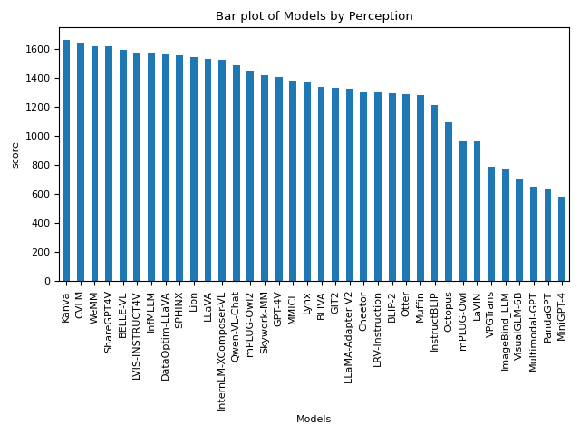
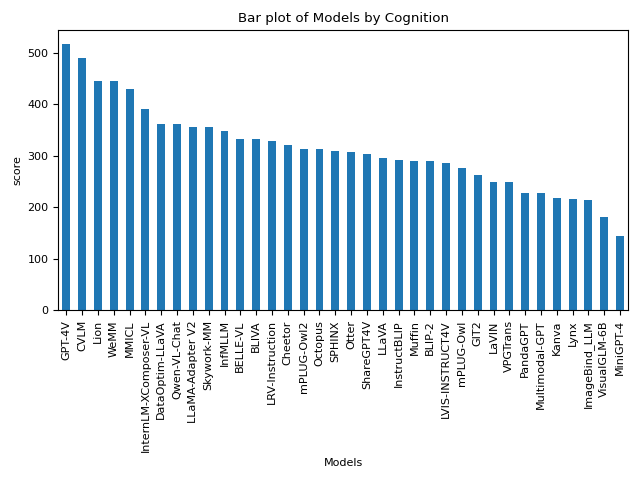

# MLLM-Research-Learn

---

- Conducting learning and research on MLLM based on the [MME](https://github.com/BradyFU/Awesome-Multimodal-Large-Language-Models) rankings.

## MLLM List

**36** advanced MLLMs, including [**BLIP-2**](https://arxiv.org/pdf/2301.12597.pdf), [**InstructBLIP**](https://arxiv.org/pdf/2305.06500.pdf), [**LLaVA**](https://arxiv.org/pdf/2304.08485.pdf), [**MiniGPT-4**](https://arxiv.org/pdf/2304.10592.pdf), [**mPLUG-Owl**](https://arxiv.org/pdf/2304.14178.pdf), [**LLaMA-Adapter V2**](https://arxiv.org/pdf/2304.15010.pdf), [**ImageBind_LLM**](https://github.com/OpenGVLab/LLaMA-Adapter/tree/main), [**Otter**](https://arxiv.org/pdf/2305.03726.pdf), [**VisualGLM-6B**](https://github.com/THUDM/VisualGLM-6B), [**Multimodal-GPT**](https://arxiv.org/pdf/2305.04790.pdf), [**PandaGPT**](https://arxiv.org/pdf/2305.16355.pdf), [**VPGTrans**](https://arxiv.org/pdf/2305.01278.pdf), [**LaVIN**](https://arxiv.org/pdf/2305.15023.pdf), [**Lynx**](https://arxiv.org/pdf/2307.02469.pdf), [**Octopus**](https://github.com/gray311/UnifiedMultimodalInstructionTuning), [**LRV-Instruction**](https://arxiv.org/pdf/2306.14565.pdf), [**Cheetor**](https://arxiv.org/pdf/2308.04152.pdf), [**MMICL**](https://github.com/HaozheZhao/MIC), [**GIT2**](https://arxiv.org/pdf/2205.14100.pdf), [**BLIVA**](https://arxiv.org/pdf/2308.09936.pdf), [**Skywork-MM**](https://github.com/will-singularity/Skywork-MM/tree/main), [**Qwen-VL-Chat**](https://arxiv.org/pdf/2308.12966.pdf), [**InternLM-XComposer-VL**](https://arxiv.org/pdf/2309.15112.pdf), [**Lion**](https://github.com/mynameischaos/Lion), [**Muffin**](https://github.com/thunlp/Muffin), [**WeMM**](https://github.com/scenarios/WeMM), [**SPHINX**](https://github.com/Alpha-VLLM/LLaMA2-Accessory/tree/main/SPHINX), [**InfMLLM**](https://github.com/mightyzau/InfMLLM), [**mPLUG-Owl2**](https://github.com/X-PLUG/mPLUG-Owl/tree/main/mPLUG-Owl2), [**GPT-4V**](https://cdn.openai.com/papers/GPTV_System_Card.pdf), [**CVLM**](https://github.com/buptlihang/CVLM), [**LVIS-INSTRUCT4V**](https://arxiv.org/pdf/2311.07574.pdf), [**Kanva**](https://github.com/llp1992/Kanva), [**DataOptim**](https://github.com/BAAI-DCAI/DataOptim), [**ShareGPT4V**](https://github.com/InternLM/InternLM-XComposer/tree/main/projects/ShareGPT4V)and **[BELLE-VL](https://huggingface.co/BELLE-2/BELLE-VL)** .

---

|                      Models_Perception                       |                       Models_Cognition                       |
| :----------------------------------------------------------: | :----------------------------------------------------------: |
|  |  |

---

## MLLM Arch

- [FlanT5xxl](#FlanT5xxl)

- [LLaMA/LLaMA2](#LLaMA/LLaMA2)

- [Vicuna](#Vicuna)

- [OpenFlamingo](#OpenFlamingo)

- [InternLM](#InternLM)

- [Qwen](#Qwen)

- [GLM](#GLM)

- [MPT](#MPT)

- [Other](#Other)

- ...

---

### FlanT5xxl

| Num. |   Arch.   |                        Model                         |                           Version                            | Perception | Cognition |
| :--: | :-------: | :--------------------------------------------------: | :----------------------------------------------------------: | :--------: | :-------: |
|  1   | FlanT5xxl |    [BLIP-2](https://arxiv.org/pdf/2301.12597.pdf)    | [Flant5xxl](https://github.com/salesforce/LAVIS/tree/main/projects/blip2) |  1293.84   |  290.00   |
|  2   | FlanT5xxl | [InstructBLIP](https://arxiv.org/pdf/2305.06500.pdf) | [FlanT5xxl](https://github.com/salesforce/LAVIS/tree/main/projects/instructblip) |  1212.82   |  291.79   |
|  3   | FlanT5xxl |      [MMICL](https://github.com/HaozheZhao/MIC)      |      [FlanT5xxl](https://arxiv.org/pdf/2309.07915.pdf)       |  1381.73   |  428.93   |
|  4   | FlanT5xxl |    [BLIVA](https://arxiv.org/pdf/2308.09936.pdf)     |       [FlanT5xxl](https://github.com/mlpc-ucsd/BLIVA)        |  1337.73   |  331.43   |

---

### LLaMA/LLaMA2

| Num. | Arch. |                            Model                             |                           Version                            | Perception | Cognition |
| :--: | :---: | :----------------------------------------------------------: | :----------------------------------------------------------: | :--------: | :-------: |
|  1   | LLaMA |      [mPLUG-Owl](https://arxiv.org/pdf/2304.14178.pdf)       | [Llama-7B](https://huggingface.co/MAGAer13/mplug-owl-llama-7b) |   967.34   |  276.07   |
|  2   | LLaMA | [SPHINX](https://github.com/Alpha-VLLM/LLaMA2-Accessory/tree/main/SPHINX) | [LLaMA2-13B](https://github.com/Alpha-VLLM/LLaMA2-Accessory/tree/main/SPHINX) |  1560.15   |  310.00   |
|  3   | LLaMA |        [LaVIN](https://arxiv.org/pdf/2305.15023.pdf)         |       [LAVIN-13B](https://github.com/luogen1996/LaVIN)       |   963.60   |  249.64   |
|  4   | LLaMA |      [mPLUG-Owl2](https://arxiv.org/pdf/2311.04257.pdf)      | [LLaMA2-7B](https://github.com/X-PLUG/mPLUG-Owl/tree/main/mPLUG-Owl2) |  1450.20   |  313.21   |
|  5   | LLaMA |   [LLaMA-Adapter V2](https://arxiv.org/pdf/2304.15010.pdf)   | [LLaMA-Adapter-v2.1-7B](https://github.com/OpenGVLab/LLaMA-Adapter/tree/main/llama_adapter_v2_multimodal7b) |  1328.39   |  356.43   |

---

### Vicuna

| Num. | Arch.  |                           Model                           |                           Version                            | Perception | Cognition |
| :--: | :----: | :-------------------------------------------------------: | :----------------------------------------------------------: | :--------: | :-------: |
|  1   | Vicuna |     [MiniGPT-4](https://arxiv.org/pdf/2304.10592.pdf)     |    [Vicuna-13B](https://github.com/Vision-CAIR/MiniGPT-4)    |   581.66   |  144.29   |
|  2   | Vicuna |     [PandaGPT](https://arxiv.org/pdf/2305.16355.pdf)      |       [Vicuna-7B](https://github.com/yxuansu/PandaGPT)       |   642.59   |  228.57   |
|  3   | Vicuna |       [LLaVA](https://arxiv.org/pdf/2304.08485.pdf)       |      [Vicuna-13B](https://github.com/haotian-liu/LLaVA)      |  1531.31   |  295.36   |
|  4   | Vicuna |       [LaVIN](https://arxiv.org/pdf/2305.15023.pdf)       |       [LAVIN-13B](https://github.com/luogen1996/LaVIN)       |   963.60   |  249.64   |
|  5   | Vicuna |     [VPGTrans](https://arxiv.org/pdf/2305.01278.pdf)      |      [Vicuna-7B](https://github.com/VPGTrans/VPGTrans)       |   790.45   |  249.29   |
|  6   | Vicuna |       [Lynx](https://arxiv.org/pdf/2307.02469.pdf)        |      [Vicuna-7B](https://github.com/bytedance/lynx-llm)      |  1373.24   |  215.71   |
|  7   | Vicuna |      [Cheetor](https://arxiv.org/pdf/2308.04152.pdf)      |       [Vicuna-7B](https://github.com/DCDmllm/Cheetah)        |  1299.97   |  321.07   |
|  8   | Vicuna |        [Muffin](https://github.com/thunlp/Muffin)         |        [Vicuna-13B](https://github.com/thunlp/Muffin)        |  1281.02   |  290.00   |
|  9   | Vicuna |      [InfMLLM](https://github.com/mightyzau/InfMLLM)      |      [Vicuna-13B](https://github.com/mightyzau/InfMLLM)      |  1567.99   |  347.14   |
|  10  | Vicuna |        [CVLM](https://github.com/buptlihang/CVLM)         |       [Vicuna-13B](https://github.com/buptlihang/CVLM)       |  1636.45   |  488.93   |
|  11  | Vicuna |  [LVIS-INSTRUCT4V](https://arxiv.org/pdf/2311.07574.pdf)  |    [Vicuna-13B](https://github.com/X2FD/LVIS-INSTRUCT4V)     |  1574.89   |  286.79   |
|  12  | Vicuna |    [ShareGPT4V](https://arxiv.org/pdf/2311.12793.pdf)     | [Vicuna-13B](https://github.com/InternLM/InternLM-XComposer/tree/main/projects/ShareGPT4V) |  1618.70   |  303.21   |
|  13  | Vicuna | [DataOptim-LLaVA](https://github.com/BAAI-DCAI/DataOptim) |     [Vicuna-13B](https://github.com/BAAI-DCAI/DataOptim)     |  1563.56   |  361.07   |
|      |        |                                                           |                                                              |            |           |

---

### OpenFlamingo

| Num. |    Arch.     |                         Model                          |                           Version                            | Perception | Cognition |
| :--: | :----------: | :----------------------------------------------------: | :----------------------------------------------------------: | :--------: | :-------: |
|  1   | OpenFlamingo | [Multimodal-GPT](https://arxiv.org/pdf/2305.04790.pdf) | [Multimodal-GPT-9B](https://github.com/open-mmlab/Multimodal-GPT) |   654.72   |  226.79   |
|  2   | OpenFlamingo |     [Otter](https://arxiv.org/pdf/2305.03726.pdf)      |    [OTTER-Image-MPT7B](https://github.com/Luodian/Otter)     |  1292.26   |  306.43   |
|      |              |                                                        |                                                              |            |           |

---

### InternLM

| Num. |  Arch.   |                            Model                             |                           Version                            | Perception | Cognition |
| :--: | :------: | :----------------------------------------------------------: | :----------------------------------------------------------: | :--------: | :-------: |
|  1   | InternLM | [InternLM-XComposer-VL](https://github.com/InternLM/InternLM-XComposer) | [InternLM-7B](https://github.com/InternLM/InternLM-XComposer) |  1528.45   |  391.07   |
|  2   | InternLM |        [Lion](https://github.com/mynameischaos/Lion)         |     [InternLM-7B](https://github.com/mynameischaos/Lion)     |  1545.80   |  445.71   |
|  3   | InternLM |          [WeMM](https://github.com/scenarios/WeMM)           |       [InternLM-7B](https://github.com/scenarios/WeMM)       |  1621.66   |  445.00   |
|      |          |                                                              |                                                              |            |           |

---

### Qwen

| Num. | Arch. |                        Model                        |                       Version                       | Perception | Cognition |
| :--: | :---: | :-------------------------------------------------: | :-------------------------------------------------: | :--------: | :-------: |
|  1   | Qwen  | [Qwen-VL-Chat](https://github.com/QwenLM/Qwen-VL/)  |    [Qwen-7B](https://github.com/QwenLM/Qwen-VL)     |  1487.58   |  360.71   |
|  2   | Qwen  |      [Kanva](https://github.com/llp1992/Kanva)      |    [Qwen-14B](https://github.com/llp1992/Kanva)     |  1666.08   |  217.14   |
|  3   | Qwen  | [BELLE-VL](https://huggingface.co/BELLE-2/BELLE-VL) | [Qwen-14B](https://huggingface.co/BELLE-2/BELLE-VL) |  1595.34   |  332.14   |

---

### MPT

| Num. | Arch. |                            Model                             |                           Version                            | Perception | Cognition |
| :--: | :---: | :----------------------------------------------------------: | :----------------------------------------------------------: | :--------: | :-------: |
|  1   |  MPT  | [Octopus](https://github.com/gray311/UnifiedMultimodalInstructionTuning) | [MPT7B](https://github.com/gray311/UnifiedMultimodalInstructionTuning) |  1095.75   |  312.50   |
|  2   |  MPT  |        [Otter](https://arxiv.org/pdf/2305.03726.pdf)         |    [OTTER-Image-MPT7B](https://github.com/Luodian/Otter)     |  1292.26   |  306.43   |

---

### GLM

| Num. | Arch. |                         Model                         |                        Version                        | Perception | Cognition |
| :--: | :---: | :---------------------------------------------------: | :---------------------------------------------------: | :--------: | :-------: |
|  1   |  GLM  | [VisualGLM-6B](https://github.com/THUDM/VisualGLM-6B) | [VisualGLM-6B](https://github.com/THUDM/VisualGLM-6B) |   705.31   |  181.79   |

---

### Other

| Num. |                Arch.                 |                            Model                             |                           Version                            | Perception | Cognition |
| :--: | :----------------------------------: | :----------------------------------------------------------: | :----------------------------------------------------------: | :--------: | :-------: |
|  1   | imagebind_huge+Open-Chinese-LLaMA-7B | [ImageBind_LLM](https://github.com/OpenGVLab/LLaMA-Adapter/tree/main) | [imagebind_LLM-7B](https://github.com/OpenGVLab/LLaMA-Adapter/tree/main/imagebind_LLM) |   775.77   |  213.57   |
|  2   |            MiniGPT/LLaMA             |   [LRV-Instruction](https://arxiv.org/pdf/2306.14565.pdf)    |    [LRV-7B](https://github.com/FuxiaoLiu/LRV-Instruction)    |  1299.79   |  286.79   |
|  3   |                                      |                                                              |                                                              |            |           |

